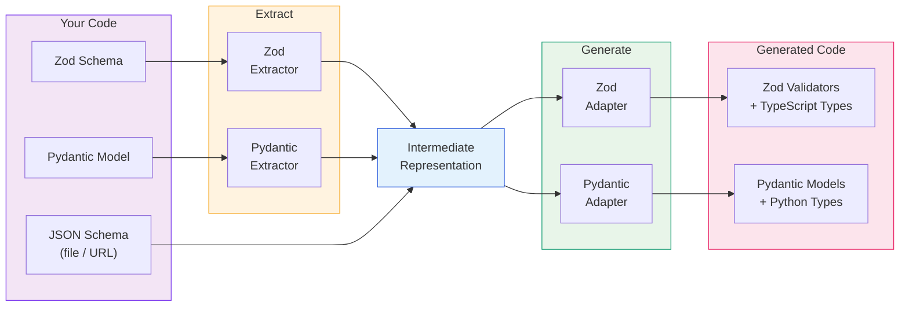
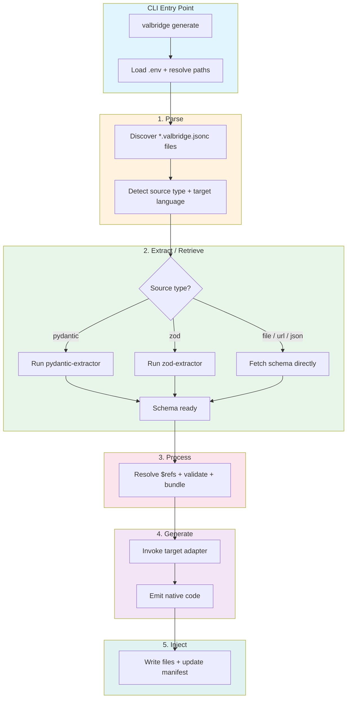

<div align="center">

# 

**Stop hand-writing validators twice. Convert directly between Zod and Pydantic - bidirectional, type-safe, zero drift.**

<br />

<a href="https://github.com/vectorfy-co/valbridge/actions/workflows/ci.yml"></a>
<a href="https://github.com/vectorfy-co/valbridge/actions/workflows/compliance.yml"></a>
<a href="https://github.com/vectorfy-co/valbridge/releases"></a>
<a href="https://www.npmjs.com/package/@vectorfyco/valbridge-cli"></a>
<a href="https://pypi.org/project/valbridge-cli/"></a>
<a href="https://github.com/vectorfy-co/valbridge/blob/main/LICENSE"></a>

</div>

---

<div align="left">
  <table>
    <tr>
      <td><strong>Core Stack</strong></td>
      <td>
        
        
        
        
        
        
      </td>
    </tr>
    <tr>
      <td><strong>Navigation</strong></td>
      <td>
        <a href="#the-problem"></a>
        <a href="#quick-start"></a>
        <a href="#installation"></a>
        <a href="#features"></a>
        <a href="#how-it-works"></a>
        <a href="#packages"></a>
        <a href="#configuration"></a>
        <a href="#architecture"></a>
      </td>
    </tr>
  </table>
</div>

---

<a id="the-problem"></a>

## 

If you build AI applications, you know this pain. Your LLM outputs structured data. Your TypeScript frontend validates it with Zod. Your Python backend validates it with Pydantic. And somewhere between those two validators - written by hand, months apart, by different people - the contract silently breaks.

**The nightmare looks like this:**

- Your Zod schema accepts `email` as optional. Your Pydantic model requires it. The LLM returns no email. TypeScript says fine. Python throws `ValidationError` in production. At 2 AM.
- Someone adds a `metadata` field to the Pydantic model. Nobody updates the Zod schema. The frontend silently drops the field. The feature "works" in Python tests but is broken for every user.
- Your team decides to tighten a string constraint to `maxLength: 100` on one side. The other side still accepts 10,000 characters. Your database truncates silently.

This is not a tooling gap. This is a **correctness gap**. Every hand-maintained cross-language validator pair is a ticking time bomb. The bigger your team, the faster the drift. The more schemas you have, the more surfaces silently diverge.

**valbridge eliminates validator drift entirely.** Point it at your existing Zod schemas and it generates Pydantic models. Point it at your Pydantic models and it generates Zod schemas. Direct, bidirectional conversion - no intermediate format to learn, no JSON Schema to write by hand. Keep working in the language you know. When the source changes, the other side updates automatically. No hand-syncing. No silent drift. No 2 AM pages.

**Why valbridge exists:** When Zod v4 shipped, nothing could convert between it and Pydantic. Existing tools targeted Zod v3 and broke on v4's new API surface. valbridge was built from scratch for Zod v4+ and Pydantic v2 - not patched on top of v3 tooling. It handles the hard cases other tools skip: discriminated unions, recursive types, conditional schemas, tuples with rest items, `oneOf` exactly-one semantics, and more. The result is **100% JSON Schema Test Suite compliance** for Zod and **99.8% for Pydantic** - across every draft from draft3 to 2020-12.

---

<a id="quick-start"></a>

## 

### Pydantic to Zod

Already have Pydantic models? Generate Zod schemas directly from them.

**1. Create a config file** (`models.valbridge.jsonc`):

```jsonc
{
  "$schema": "https://github.com/vectorfy-co/valbridge/schemas/typescript.jsonc",
  "schemas": [
    {
      "id": "User",
      "sourceType": "pydantic",
      "source": "app.models:UserModel",
      "adapter": "@vectorfyco/valbridge-zod"
    }
  ]
}
```

**2. Generate:**

```bash
npx -y @vectorfyco/valbridge-cli generate
```

That's it. valbridge extracts the schema from your Pydantic model and generates a type-safe Zod validator. No JSON Schema to write.

### Zod to Pydantic

Already have Zod schemas? Generate Pydantic models directly from them.

**1. Create a config file** (`schemas.valbridge.jsonc`):

```jsonc
{
  "$schema": "https://github.com/vectorfy-co/valbridge/schemas/python.jsonc",
  "schemas": [
    {
      "id": "User",
      "sourceType": "zod",
      "source": "./src/schemas/user.ts",
      "export": "userSchema",
      "adapter": "vectorfyco/valbridge-pydantic"
    }
  ]
}
```

**2. Generate:**

```bash
uvx valbridge-cli generate
```

valbridge extracts the schema from your Zod code and generates a native Pydantic BaseModel. No JSON Schema to write.

### From JSON Schema (also supported)

If you prefer a schema-first workflow, you can also generate from JSON Schema files, URLs, or inline definitions:

```jsonc
{
  "$schema": "https://github.com/vectorfy-co/valbridge/schemas/typescript.jsonc",
  "schemas": [
    {
      "id": "User",
      "sourceType": "file",
      "source": "./schemas/user.json",
      "adapter": "@vectorfyco/valbridge-zod"
    }
  ]
}
```

---

<a id="installation"></a>

## 

### Zero-install (recommended for CI/CD)

Run the CLI directly without installing anything globally:

```bash
# npm/npx
npx -y @vectorfyco/valbridge-cli generate

# Python/uvx
uvx valbridge-cli generate
```

The launcher automatically downloads the correct platform binary on first run and caches it locally.

### Global install (recommended for local development)

Install once and use the `valbridge` command everywhere:

```bash
# npm
npm install -g @vectorfyco/valbridge-cli

# pnpm
pnpm add -g @vectorfyco/valbridge-cli

# pip
pip install valbridge-cli

# uv (recommended for Python)
uv tool install valbridge-cli
```

After installing, run:

```bash
valbridge generate --help
```

### Runtime packages

Install the packages your generated code depends on:

**TypeScript projects:**

```bash
# Core client (runtime schema lookup)
npm install @vectorfyco/valbridge

# Zod adapter (peer dependency)
npm install zod
```

**Python projects:**

```bash
# Core client (runtime schema lookup)
pip install valbridge

# Pydantic adapter (peer dependency)
pip install pydantic
```

---

<a id="features"></a>

## 

| Feature | Details |
| --- | --- |
|  | Convert directly between Zod and Pydantic in both directions - no JSON Schema to write by hand |
|  | Built from scratch for Zod v4+ (not patched v3 tooling). Uses native v4 APIs: `.meta()`, `.prefault()`, `z.uuidv4()`, discriminated unions, pipe transforms |
|  | Generates native Pydantic v2 BaseModel classes with `Field()` metadata, `StrictStr`/`StrictInt`, discriminator support |
|  | Passes the official JSON Schema Test Suite across all drafts (draft3 through 2020-12) |
|  | Handles the hard cases: discriminated unions, recursive `$ref`, `allOf` intersections, `if`/`then`/`else`, tuples, `oneOf`, `patternProperties`, and [more](docs/type-support.md) |
|  | Transports `description`, `title`, `examples`, `default`, `deprecated`, `readOnly`, `writeOnly` across languages - nothing is silently dropped |
|  | Generated code is fully typed - schema keys autocomplete, invalid lookups fail at compile time |
|  | Point at existing Zod or Pydantic code and valbridge extracts the schema automatically |
|  | Fast Go binary with parallel schema fetching, caching, dry-run mode, and watch support |
|  | Also supports JSON Schema 2020-12 files/URLs as input with `$ref` resolution and bundling |
|  | Structured diagnostics for every non-exact mapping; strict mode fails on drift |

---

<a id="type-support"></a>

## 

valbridge handles complex types that other tools skip. Here's what converts cleanly between Zod and Pydantic:

| Category | What's Supported | Zod Output | Pydantic Output |
| --- | --- | --- | --- |
| **Discriminated unions** | Tagged unions with a discriminator key | `z.discriminatedUnion("type", [...])` | `Annotated[Union[A, B], Field(discriminator="type")]` |
| **Recursive types** | Self-referencing `$ref` cycles | `z.lazy(() => schema)` | Forward reference strings + `model_rebuild()` |
| **Intersections (`allOf`)** | Merging multiple object schemas | `z.intersection(a, b)` | Static field merge into single BaseModel |
| **Exactly-one (`oneOf`)** | Must match exactly one sub-schema | `z.unknown().superRefine(...)` counting matches | `BeforeValidator` counting TypeAdapter matches |
| **Conditional (`if/then/else`)** | Schema branching on conditions | `z.unknown().superRefine(...)` with branch dispatch | `BeforeValidator` with if-check and dispatch |
| **Tuples** | Fixed-length arrays with positional types, rest items | `z.array().superRefine(...)` with positional checks | `BeforeValidator` with per-position TypeAdapter |
| **Pattern properties** | Regex-keyed object validation | `.passthrough().superRefine(...)` with regex tests | `model_validator` with `re.search()` |
| **Dependent schemas** | Properties required when another is present | `.superRefine(...)` conditional schema application | `model_validator` checking co-presence |
| **String formats** | `email`, `uri`, `uuid`, `date-time`, `ipv4`, `ipv6`, `hostname` | Native Zod methods (`.email()`, `.url()`, `.uuid()`, `.datetime()`) | Pydantic format types + `AnyUrl`, `EmailStr` |
| **Const / Enum** | Fixed values including complex objects and mixed types | `z.literal()` or deep equality refinement | `Literal[...]` or `_make_const_validator` with JSON equality |
| **Nullable** | Optional null types | `.nullable()` | `T \| None` |
| **Type guards** | Per-type dispatch (`string` vs `object` vs `array`) | `z.unknown().superRefine(...)` with typeof checks | `BeforeValidator` with `isinstance` dispatch |

### Metadata transport

valbridge preserves metadata across languages - nothing is silently dropped:

| Metadata | Zod v4 Output | Pydantic v2 Output |
| --- | --- | --- |
| `description` | `.describe("...")` | `Field(description="...")` |
| `title` | `.meta({ title: "..." })` | `Field(title="...")` |
| `examples` | `.meta({ examples: [...] })` | `Field(examples=[...])` |
| `default` | `.default(value)` | `Field(default=value)` |
| `deprecated` | `.meta({ deprecated: true })` | `Field(deprecated=True)` |
| `readOnly` / `writeOnly` | `.meta({ readOnly: true })` | `Field(json_schema_extra={"readOnly": True})` |

### Zod v4-specific features

These Zod v4 APIs are natively supported - not approximated or shimmed:

- `z.uuidv4()`, `z.uuidv6()`, `z.uuidv7()` - versioned UUID validators
- `.meta()` - rich metadata beyond description (title, examples, deprecated)
- `.prefault(value)` - default that applies before validation (v4-only)
- `z.pipe()` - transform pipelines detected and annotated
- `z.discriminatedUnion()` - first-class discriminator support
- `z.iso.datetime()`, `z.iso.date()`, `z.iso.time()` - ISO string validators

For the complete mapping table with fidelity classifications, see [docs/direct-converter/feature-matrix.md](docs/direct-converter/feature-matrix.md).

### Compliance results

Tested against the official [JSON Schema Test Suite](https://github.com/json-schema-org/JSON-Schema-Test-Suite):

| Draft | Zod Adapter | Pydantic Adapter |
| --- | --- | --- |
| draft2020-12 | 1048/1048 (100%) | 1046/1048 (99.8%) |
| draft2019-09 | 1034/1034 (100%) | 1032/1034 (99.8%) |
| draft7 | 909/909 (100%) | 907/909 (99.8%) |
| draft6 | 825/825 (100%) | 823/825 (99.8%) |
| draft4 | 606/606 (100%) | 605/606 (99.8%) |
| draft3 | 429/429 (100%) | 428/429 (99.8%) |

The only excluded tests are `$dynamicRef`/`$recursiveAnchor` (dynamic scope tracking that cannot be compiled to static validators) and metaschema self-validation.

---

<a id="how-it-works"></a>

## 

valbridge converts directly between Zod and Pydantic in both directions. The extractors pull a schema from your existing code, and the adapters generate native code in the target language:



**You never touch the intermediate representation.** valbridge handles extraction, conversion, and code generation automatically:

1. **Parse** - Discovers `*.valbridge.jsonc` config files, detects the source type and target language
2. **Extract** - For `pydantic` or `zod` sources, runs the extractor to pull a schema from your existing code
3. **Retrieve** - For `file`, `url`, or `json` sources, fetches schemas directly (with parallel fetching and caching)
4. **Process** - Resolves `$ref` references, validates, and bundles into self-contained schemas
5. **Generate** - Invokes the target adapter (Zod or Pydantic) to emit native, idiomatic code
6. **Inject** - Writes generated files with import merging, manifest tracking, and stale file cleanup

---

<a id="packages"></a>

## 

### npm (`@vectorfyco` scope)

| Package | Version | Purpose |
| --- | --- | --- |
| [`@vectorfyco/valbridge-cli`](https://www.npmjs.com/package/@vectorfyco/valbridge-cli) |  | CLI launcher for npm/npx |
| [`@vectorfyco/valbridge`](https://www.npmjs.com/package/@vectorfyco/valbridge) |  | Runtime client with type-safe schema lookup |
| [`@vectorfyco/valbridge-core`](https://www.npmjs.com/package/@vectorfyco/valbridge-core) |  | Core IR, diagnostics, JSON Schema parser |
| [`@vectorfyco/valbridge-zod`](https://www.npmjs.com/package/@vectorfyco/valbridge-zod) |  | Zod 4.x adapter (JSON Schema to Zod) |
| [`@vectorfyco/valbridge-zod-extractor`](https://www.npmjs.com/package/@vectorfyco/valbridge-zod-extractor) |  | Extract JSON Schema from Zod schemas |
| [`@vectorfyco/valbridge-zod-bridge`](https://www.npmjs.com/package/@vectorfyco/valbridge-zod-bridge) |  | Bridge helpers for Zod generation |

### PyPI

| Package | Version | Purpose |
| --- | --- | --- |
| [`valbridge-cli`](https://pypi.org/project/valbridge-cli/) |  | CLI launcher for pip/uvx |
| [`valbridge`](https://pypi.org/project/valbridge/) |  | Runtime client with type-safe schema lookup |
| [`valbridge-core`](https://pypi.org/project/valbridge-core/) |  | Core IR, diagnostics, JSON Schema parser |
| [`valbridge-pydantic`](https://pypi.org/project/valbridge-pydantic/) |  | Pydantic v2 adapter (JSON Schema to Pydantic) |
| [`valbridge-pydantic-extractor`](https://pypi.org/project/valbridge-pydantic-extractor/) |  | Extract JSON Schema from Pydantic models |
| [`valbridge-pydantic-bridge`](https://pypi.org/project/valbridge-pydantic-bridge/) |  | Bridge helpers for Pydantic generation |

---

<a id="configuration"></a>

## 

### Config file format

valbridge discovers config files by matching the `$schema` URL. Files must end in `.json` or `.jsonc`.

The filename (minus extension) becomes the **namespace** for all schemas in that file.

```jsonc
{
  // Target language is detected from the $schema URL
  "$schema": "https://github.com/vectorfy-co/valbridge/schemas/typescript.jsonc",
  "schemas": [
    {
      "id": "User",
      "sourceType": "pydantic",                   // Extract from existing Pydantic model
      "source": "app.models:UserModel",           // module:Class format
      "adapter": "@vectorfyco/valbridge-zod"      // Generate Zod output
    }
  ]
}
```

### Schema sources

| Source Type | Description | Example |
| --- | --- | --- |
| `pydantic` | Extract from an existing Pydantic model | `"app.models:UserModel"` |
| `zod` | Extract from an existing Zod schema | `"./src/schemas/user.ts"` (+ `"export"` field) |
| `file` | Local JSON Schema file (relative to config) | `"./schemas/user.json"` |
| `url` | Remote JSON Schema (HTTP/HTTPS) | `"https://api.example.com/schemas/user"` |
| `json` | Inline JSON Schema object | `{ "type": "object", ... }` |

### Pydantic extraction options

When using `sourceType: "pydantic"`:

| Field | Description |
| --- | --- |
| `source` | `module:Class` format (required) |
| `pythonPath` | Import paths to prepend before loading |
| `moduleRoot` | Module roots for project-local imports |
| `stubModules` | Placeholder modules for optional imports |
| `env` | Environment variables to inject before import |

### Zod extraction options

When using `sourceType: "zod"`:

| Field | Description |
| --- | --- |
| `source` | Path to TypeScript file (required) |
| `export` | Named export in that file (required) |

### CLI flags

| Flag | Short | Default | Description |
| --- | --- | --- | --- |
| `--project` | `-p` | `.` | Project root directory |
| `--output` | `-o` | language default | Output directory for generated files |
| `--lang` | | auto | Filter to a specific language |
| `--verbose` | `-v` | `false` | Show verbose output |
| `--dry-run` | | `false` | Preview output without writing files |
| `--concurrency` | `-c` | min(CPUs, 8) | Parallel schema fetch limit |
| `--env-file` | | `.env` | Path to `.env` file for header variable substitution |
| `--strict` | | `false` | Treat warnings as failures |
| `--quiet` | | `false` | Suppress informational diagnostics |
| `--watch` | `-w` | `false` | Watch for changes and regenerate |

### Using the runtime client

**TypeScript:**

```typescript
import { createValbridgeClient } from "@vectorfyco/valbridge";
import type { ValbridgeType } from "@vectorfyco/valbridge";
import { schemas } from "./.valbridge/valbridge.gen.js";

const valbridge = createValbridgeClient({ schemas, defaultNamespace: "user" });

// Runtime validation with full autocomplete
const user = valbridge("Profile").parse(unknownData);

// Type extraction (zero runtime cost)
type User = ValbridgeType<"user:Profile">;
```

**Python:**

```python
from valbridge import create_valbridge
from _valbridge import schemas

valbridge = create_valbridge(schemas)

# Runtime validation
user = valbridge("user:Profile").validate_python(data)
```

---

<a id="cli-commands"></a>

## 

### `generate`

Parse config files and generate native validators:

```bash
valbridge generate                          # Generate all
valbridge generate --lang typescript        # TypeScript (Zod) only
valbridge generate --lang python            # Python (Pydantic) only
valbridge generate --dry-run                # Preview without writing
valbridge generate --strict                 # Fail on any warnings
valbridge generate -v                       # Verbose output
```

### `extract`

Extract a single schema as JSON (useful for debugging):

```bash
valbridge extract --schema user:Profile
valbridge extract --schema user:Profile --lang typescript
valbridge extract --schema user:Profile --lang python
```

### `compliance`

Run the JSON Schema Test Suite against an adapter:

```bash
# Zod adapter
valbridge compliance --lang typescript --adapter-path ./typescript/packages/adapters/zod

# Pydantic adapter
valbridge compliance --lang python --adapter-path ./python/packages/adapters/pydantic
```

---

<a id="architecture"></a>

## 

### Repository structure

```
valbridge/
├── cli/                        # Go CLI (main orchestrator)
│   ├── cmd/                    # Commands (generate, extract, compliance)
│   ├── parser/                 # Config file discovery and parsing
│   ├── retriever/              # Schema fetching (file, URL, inline)
│   ├── processor/              # $ref crawling, validation, bundling
│   ├── generator/              # Adapter invocation and output collection
│   ├── injector/               # File writing with manifest tracking
│   ├── bundler/                # JSON Schema bundling engine
│   ├── validator/              # JSON Schema validation
│   └── language/               # Language registry and specs
├── typescript/                 # TypeScript packages (pnpm workspace)
│   ├── packages/
│   │   ├── core/               # IR types, parser, diagnostics
│   │   ├── client/             # Runtime schema lookup client
│   │   ├── cli/                # npm CLI launcher
│   │   ├── adapters/zod/       # Zod renderer
│   │   ├── zod-extractor/      # Zod-to-JSON-Schema extraction
│   │   └── zod-bridge/         # Bridge helpers for Zod
│   └── example/                # Example TypeScript project
├── python/                     # Python packages (uv workspace)
│   ├── packages/
│   │   ├── core/               # IR types, parser, diagnostics
│   │   ├── client/             # Runtime schema lookup client
│   │   ├── cli/                # PyPI CLI launcher
│   │   ├── adapters/pydantic/  # Pydantic renderer
│   │   ├── pydantic-extractor/ # Pydantic-to-JSON-Schema extraction
│   │   └── pydantic-bridge/    # Bridge helpers for Pydantic
│   └── example/                # Example Python project
└── docs/                       # Documentation
    └── direct-converter/       # Feature matrix and design docs
```

### Pipeline architecture



### Fidelity system

valbridge classifies every cross-language mapping into fidelity tiers:

| Tier | Meaning | Example |
| --- | --- | --- |
| `native_exact` | Direct library construct, semantically equivalent | `StrictStr` to `z.string()` |
| `native_approximate` | Library construct exists, known semantic drift | `AnyUrl` to `z.url()` |
| `bridge_helper` | Small repo-local runtime helper fills the gap | Past/future date predicates |
| `unsupported_stub` | Cannot emit safely; diagnostic or strict-mode failure | Custom validators |

Every non-exact mapping emits a structured diagnostic. In `--strict` mode, approximate and unsupported mappings fail generation instead of producing drift.

---

<a id="dev-workflow"></a>

## 

### Prerequisites

- Go 1.21+
- Node.js 18+ and pnpm
- Python 3.10+ and [uv](https://docs.astral.sh/uv/)

### Setup

```bash
# TypeScript packages
cd typescript && pnpm install

# Python packages
cd ../python && uv sync

# Go CLI
cd ../cli && go build -o valbridge .
```

### Testing

```bash
# TypeScript
cd typescript && pnpm run test && pnpm run typecheck

# Python
cd python && uv run pytest

# Go CLI
cd cli && go test ./...
```

### Local development with workspace packages

Use local adapters/extractors instead of published versions:

```bash
valbridge --workspace-root /path/to/valbridge --prefer-workspace generate
```

---

<a id="troubleshooting"></a>

## 

**CLI binary not found after `npx`/`uvx`**
- The launcher downloads the binary on first run. Ensure you have internet access and write permissions to the cache directory.
- Override with `VALBRIDGE_CLI_BIN=/path/to/binary` to use a local build.

**"Unknown schema" error at runtime**
- Run `valbridge generate` to regenerate. The schema key must match `namespace:id` format.

**Multiple languages detected, require `--lang` flag**
- If config files target both TypeScript and Python, pass `--lang typescript` or `--lang python` to filter.

**Adapter process exits with non-zero**
- Ensure the adapter package is installed in your project (`npm install @vectorfyco/valbridge-zod` or `pip install valbridge-pydantic`).
- Run with `-v` for verbose output showing the adapter command and stderr.

---

<a id="origin"></a>

## 

This project was originally forked from [`xschemadev/xschema`](https://github.com/xschemadev/xschema). Thanks to the original xschema work for the foundation this refactor and rebrand were built from.

---

<div align="center">

<a href="https://github.com/vectorfy-co/valbridge"></a>
<a href="https://github.com/vectorfy-co/valbridge/blob/main/LICENSE"></a>

</div>
