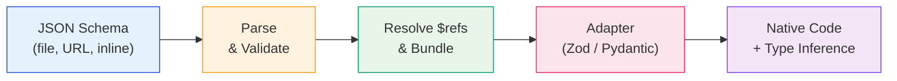
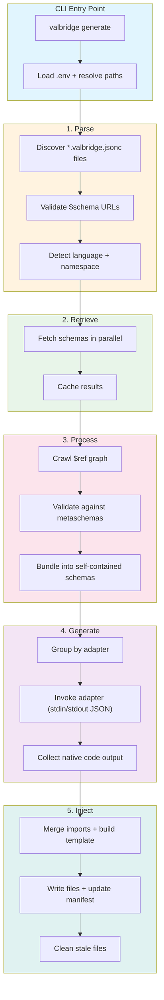

<div align="center">

# 

**Stop hand-writing validators twice. Generate type-safe Zod and Pydantic from a single JSON Schema.**

<br />

<a href="https://github.com/vectorfy-co/valbridge/actions/workflows/ci.yml"></a>
<a href="https://github.com/vectorfy-co/valbridge/actions/workflows/compliance.yml"></a>
<a href="https://github.com/vectorfy-co/valbridge/releases"></a>
<a href="https://www.npmjs.com/package/@vectorfyco/valbridge-cli"></a>
<a href="https://pypi.org/project/valbridge-cli/"></a>
<a href="https://github.com/vectorfy-co/valbridge/blob/main/LICENSE"></a>

</div>

---

<div align="left">
  <table>
    <tr>
      <td><strong>Core Stack</strong></td>
      <td>
        
        
        
        
        
        
      </td>
    </tr>
    <tr>
      <td><strong>Navigation</strong></td>
      <td>
        <a href="#the-problem"></a>
        <a href="#quick-start"></a>
        <a href="#installation"></a>
        <a href="#features"></a>
        <a href="#how-it-works"></a>
        <a href="#packages"></a>
        <a href="#configuration"></a>
        <a href="#architecture"></a>
      </td>
    </tr>
  </table>
</div>

---

<a id="the-problem"></a>

## 

If you build AI applications, you know this pain. Your LLM outputs structured data. Your TypeScript frontend validates it with Zod. Your Python backend validates it with Pydantic. And somewhere between those two validators -- written by hand, months apart, by different people -- the contract silently breaks.

**The nightmare looks like this:**

- Your Zod schema accepts `email` as optional. Your Pydantic model requires it. The LLM returns no email. TypeScript says fine. Python throws `ValidationError` in production. At 2 AM.
- Someone adds a `metadata` field to the Pydantic model. Nobody updates the Zod schema. The frontend silently drops the field. The feature "works" in Python tests but is broken for every user.
- Your team decides to tighten a string constraint to `maxLength: 100` on one side. The other side still accepts 10,000 characters. Your database truncates silently.

This is not a tooling gap. This is a **correctness gap**. Every hand-maintained cross-language validator pair is a ticking time bomb. The bigger your team, the faster the drift. The more schemas you have, the more surfaces silently diverge.

**valbridge eliminates validator drift entirely.** Define your schema once in JSON Schema. Generate native, idiomatic, type-safe Zod and Pydantic validators from a single source of truth. When the schema changes, both sides update together. No hand-syncing. No silent drift. No 2 AM pages.

---

<a id="quick-start"></a>

## 

### 1. Define your schema

Create a JSON Schema file (e.g., `schemas/user.json`):

```json
{
  "type": "object",
  "properties": {
    "id": { "type": "string", "format": "uuid" },
    "name": { "type": "string", "minLength": 1 },
    "email": { "type": "string", "format": "email" },
    "role": { "type": "string", "enum": ["admin", "user", "viewer"] }
  },
  "required": ["id", "name", "email", "role"]
}
```

### 2. Create a config file

For **TypeScript** (e.g., `user.valbridge.jsonc`):

```jsonc
{
  "$schema": "https://github.com/vectorfy-co/valbridge/schemas/typescript.jsonc",
  "schemas": [
    {
      "id": "User",
      "sourceType": "file",
      "source": "./schemas/user.json",
      "adapter": "@vectorfyco/valbridge-zod"
    }
  ]
}
```

For **Python** (e.g., `user.valbridge.jsonc`):

```jsonc
{
  "$schema": "https://github.com/vectorfy-co/valbridge/schemas/python.jsonc",
  "schemas": [
    {
      "id": "User",
      "sourceType": "file",
      "source": "./schemas/user.json",
      "adapter": "vectorfyco/valbridge-pydantic"
    }
  ]
}
```

### 3. Generate

```bash
# TypeScript (zero-install)
npx -y @vectorfyco/valbridge-cli generate

# Python (zero-install)
uvx valbridge-cli generate
```

That's it. You now have type-safe, native validators in both languages from a single schema.

---

<a id="installation"></a>

## 

### Zero-install (recommended for CI/CD)

Run the CLI directly without installing anything globally:

```bash
# npm/npx
npx -y @vectorfyco/valbridge-cli generate

# Python/uvx
uvx valbridge-cli generate
```

The launcher automatically downloads the correct platform binary on first run and caches it locally.

### Global install (recommended for local development)

Install once and use the `valbridge` command everywhere:

```bash
# npm
npm install -g @vectorfyco/valbridge-cli

# pnpm
pnpm add -g @vectorfyco/valbridge-cli

# pip
pip install valbridge-cli

# uv (recommended for Python)
uv tool install valbridge-cli
```

After installing, run:

```bash
valbridge generate --help
```

### Runtime packages

Install the packages your generated code depends on:

**TypeScript projects:**

```bash
# Core client (runtime schema lookup)
npm install @vectorfyco/valbridge

# Zod adapter (peer dependency)
npm install zod
```

**Python projects:**

```bash
# Core client (runtime schema lookup)
pip install valbridge

# Pydantic adapter (peer dependency)
pip install pydantic
```

---

<a id="features"></a>

## 

| Feature | Details |
| --- | --- |
|  | Generates idiomatic Zod 4.x validators with full TypeScript type inference |
|  | Generates native Pydantic v2 BaseModel classes with field metadata |
|  | Full JSON Schema 2020-12 support with `$ref` resolution, bundling, and vocabulary filtering |
|  | Generated code is fully typed -- schema keys autocomplete, invalid lookups fail at compile time |
|  | Extract JSON Schema from existing Zod/Pydantic code, or generate validators from JSON Schema |
|  | Fast Go binary with parallel schema fetching, caching, dry-run mode, and watch support |
|  | Small, repo-local helpers for cross-language patterns that lack a native equivalent |
|  | Built-in JSON Schema Test Suite runner to verify adapter correctness |
|  | Structured diagnostics for every non-exact mapping; strict mode fails on drift |

---

<a id="how-it-works"></a>

## 

valbridge uses a multi-stage pipeline to convert JSON Schemas into native validators:



1. **Parse** -- Discovers `*.valbridge.jsonc` config files in your project, validates them, and detects the target language
2. **Retrieve** -- Fetches schemas from files, URLs, or inline JSON (with parallel fetching and caching)
3. **Process** -- Crawls `$ref` references, validates against JSON Schema metaschemas, and bundles into self-contained schemas
4. **Generate** -- Invokes the appropriate adapter (Zod or Pydantic) to emit native, idiomatic validator code
5. **Inject** -- Writes generated files with import merging, manifest tracking, and stale file cleanup

---

<a id="packages"></a>

## 

### npm (`@vectorfyco` scope)

| Package | Version | Purpose |
| --- | --- | --- |
| [`@vectorfyco/valbridge-cli`](https://www.npmjs.com/package/@vectorfyco/valbridge-cli) |  | CLI launcher for npm/npx |
| [`@vectorfyco/valbridge`](https://www.npmjs.com/package/@vectorfyco/valbridge) |  | Runtime client with type-safe schema lookup |
| [`@vectorfyco/valbridge-core`](https://www.npmjs.com/package/@vectorfyco/valbridge-core) |  | Core IR, diagnostics, JSON Schema parser |
| [`@vectorfyco/valbridge-zod`](https://www.npmjs.com/package/@vectorfyco/valbridge-zod) |  | Zod 4.x adapter (JSON Schema to Zod) |
| [`@vectorfyco/valbridge-zod-extractor`](https://www.npmjs.com/package/@vectorfyco/valbridge-zod-extractor) |  | Extract JSON Schema from Zod schemas |
| [`@vectorfyco/valbridge-zod-bridge`](https://www.npmjs.com/package/@vectorfyco/valbridge-zod-bridge) |  | Bridge helpers for Zod generation |

### PyPI

| Package | Version | Purpose |
| --- | --- | --- |
| [`valbridge-cli`](https://pypi.org/project/valbridge-cli/) |  | CLI launcher for pip/uvx |
| [`valbridge`](https://pypi.org/project/valbridge/) |  | Runtime client with type-safe schema lookup |
| [`valbridge-core`](https://pypi.org/project/valbridge-core/) |  | Core IR, diagnostics, JSON Schema parser |
| [`valbridge-pydantic`](https://pypi.org/project/valbridge-pydantic/) |  | Pydantic v2 adapter (JSON Schema to Pydantic) |
| [`valbridge-pydantic-extractor`](https://pypi.org/project/valbridge-pydantic-extractor/) |  | Extract JSON Schema from Pydantic models |
| [`valbridge-pydantic-bridge`](https://pypi.org/project/valbridge-pydantic-bridge/) |  | Bridge helpers for Pydantic generation |

---

<a id="configuration"></a>

## 

### Config file format

valbridge discovers config files by matching the `$schema` URL. Files must end in `.json` or `.jsonc`.

The filename (minus extension) becomes the **namespace** for all schemas in that file.

```jsonc
{
  // Language is detected from the $schema URL
  "$schema": "https://github.com/vectorfy-co/valbridge/schemas/typescript.jsonc",
  "schemas": [
    {
      "id": "User",                              // Schema ID (unique within namespace)
      "sourceType": "file",                       // "file", "url", or "json"
      "source": "./schemas/user.json",            // Path, URL, or inline schema
      "adapter": "@vectorfyco/valbridge-zod"      // Which adapter generates the code
    }
  ]
}
```

### Schema sources

| Source Type | Description | Example |
| --- | --- | --- |
| `file` | Local JSON Schema file (relative to config) | `"./schemas/user.json"` |
| `url` | Remote JSON Schema (HTTP/HTTPS) | `"https://api.example.com/schemas/user"` |
| `json` | Inline JSON Schema object | `{ "type": "object", ... }` |

### CLI flags

| Flag | Short | Default | Description |
| --- | --- | --- | --- |
| `--project` | `-p` | `.` | Project root directory |
| `--output` | `-o` | language default | Output directory for generated files |
| `--lang` | | auto | Filter to a specific language |
| `--verbose` | `-v` | `false` | Show verbose output |
| `--dry-run` | | `false` | Preview output without writing files |
| `--concurrency` | `-c` | min(CPUs, 8) | Parallel schema fetch limit |
| `--env-file` | | `.env` | Path to `.env` file for header variable substitution |
| `--strict` | | `false` | Treat warnings as failures |
| `--quiet` | | `false` | Suppress informational diagnostics |
| `--watch` | `-w` | `false` | Watch for changes and regenerate |

### Using the runtime client

**TypeScript:**

```typescript
import { createValbridgeClient } from "@vectorfyco/valbridge";
import type { ValbridgeType } from "@vectorfyco/valbridge";
import { schemas } from "./.valbridge/valbridge.gen.js";

const valbridge = createValbridgeClient({ schemas, defaultNamespace: "user" });

// Runtime validation with full autocomplete
const user = valbridge("Profile").parse(unknownData);

// Type extraction (zero runtime cost)
type User = ValbridgeType<"user:Profile">;
```

**Python:**

```python
from valbridge import create_valbridge
from _valbridge import schemas

valbridge = create_valbridge(schemas)

# Runtime validation
user = valbridge("user:Profile").validate_python(data)
```

---

<a id="cli-commands"></a>

## 

### `generate`

Parse config files and generate native validators:

```bash
valbridge generate                          # Generate all
valbridge generate --lang typescript        # TypeScript only
valbridge generate --dry-run                # Preview without writing
valbridge generate --strict                 # Fail on any warnings
valbridge generate -v                       # Verbose output
```

### `extract`

Extract a single schema as JSON (useful for debugging):

```bash
valbridge extract --schema user:Profile
valbridge extract --schema user:Profile --lang typescript
```

### `compliance`

Run the JSON Schema Test Suite against an adapter:

```bash
valbridge compliance --lang typescript --adapter-path ./typescript/packages/adapters/zod
```

---

<a id="architecture"></a>

## 

### Repository structure

```
valbridge/
├── cli/                        # Go CLI (main orchestrator)
│   ├── cmd/                    # Commands (generate, extract, compliance)
│   ├── parser/                 # Config file discovery and parsing
│   ├── retriever/              # Schema fetching (file, URL, inline)
│   ├── processor/              # $ref crawling, validation, bundling
│   ├── generator/              # Adapter invocation and output collection
│   ├── injector/               # File writing with manifest tracking
│   ├── bundler/                # JSON Schema bundling engine
│   ├── validator/              # JSON Schema validation
│   └── language/               # Language registry and specs
├── typescript/                 # TypeScript packages (pnpm workspace)
│   ├── packages/
│   │   ├── core/               # IR types, parser, diagnostics
│   │   ├── client/             # Runtime schema lookup client
│   │   ├── cli/                # npm CLI launcher
│   │   ├── adapters/zod/       # Zod renderer
│   │   ├── zod-extractor/      # Zod-to-JSON-Schema extraction
│   │   └── zod-bridge/         # Bridge helpers for Zod
│   └── example/                # Example TypeScript project
├── python/                     # Python packages (uv workspace)
│   ├── packages/
│   │   ├── core/               # IR types, parser, diagnostics
│   │   ├── client/             # Runtime schema lookup client
│   │   ├── cli/                # PyPI CLI launcher
│   │   ├── adapters/pydantic/  # Pydantic renderer
│   │   ├── pydantic-extractor/ # Pydantic-to-JSON-Schema extraction
│   │   └── pydantic-bridge/    # Bridge helpers for Pydantic
│   └── example/                # Example Python project
└── docs/                       # Documentation
    └── direct-converter/       # Feature matrix and design docs
```

### Pipeline architecture



### Fidelity system

valbridge classifies every cross-language mapping into fidelity tiers:

| Tier | Meaning | Example |
| --- | --- | --- |
| `native_exact` | Direct library construct, semantically equivalent | `StrictStr` to `z.string()` |
| `native_approximate` | Library construct exists, known semantic drift | `AnyUrl` to `z.url()` |
| `bridge_helper` | Small repo-local runtime helper fills the gap | Past/future date predicates |
| `unsupported_stub` | Cannot emit safely; diagnostic or strict-mode failure | Custom validators |

Every non-exact mapping emits a structured diagnostic. In `--strict` mode, approximate and unsupported mappings fail generation instead of producing drift.

---

<a id="dev-workflow"></a>

## 

### Prerequisites

- Go 1.21+
- Node.js 18+ and pnpm
- Python 3.10+ and [uv](https://docs.astral.sh/uv/)

### Setup

```bash
# TypeScript packages
cd typescript && pnpm install

# Python packages
cd ../python && uv sync

# Go CLI
cd ../cli && go build -o valbridge .
```

### Testing

```bash
# TypeScript
cd typescript && pnpm run test && pnpm run typecheck

# Python
cd python && uv run pytest

# Go CLI
cd cli && go test ./...
```

### Local development with workspace packages

Use local adapters/extractors instead of published versions:

```bash
valbridge --workspace-root /path/to/valbridge --prefer-workspace generate
```

---

<a id="troubleshooting"></a>

## 

**CLI binary not found after `npx`/`uvx`**
- The launcher downloads the binary on first run. Ensure you have internet access and write permissions to the cache directory.
- Override with `VALBRIDGE_CLI_BIN=/path/to/binary` to use a local build.

**"Unknown schema" error at runtime**
- Run `valbridge generate` to regenerate. The schema key must match `namespace:id` format.

**Multiple languages detected, require `--lang` flag**
- If config files target both TypeScript and Python, pass `--lang typescript` or `--lang python` to filter.

**Adapter process exits with non-zero**
- Ensure the adapter package is installed in your project (`npm install @vectorfyco/valbridge-zod` or `pip install valbridge-pydantic`).
- Run with `-v` for verbose output showing the adapter command and stderr.

---

<a id="origin"></a>

## 

This project was originally forked from [`xschemadev/xschema`](https://github.com/xschemadev/xschema). Thanks to the original xschema work for the foundation this refactor and rebrand were built from.

---

<div align="center">

<a href="https://github.com/vectorfy-co/valbridge"></a>
<a href="https://github.com/vectorfy-co/valbridge/blob/main/LICENSE"></a>

</div>
