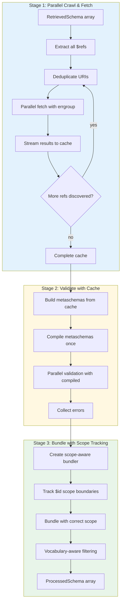
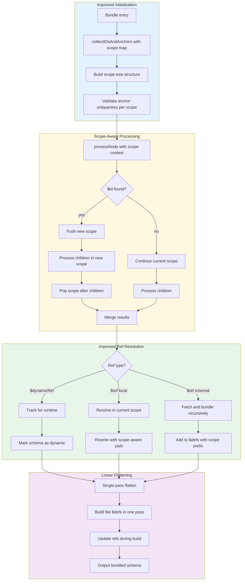
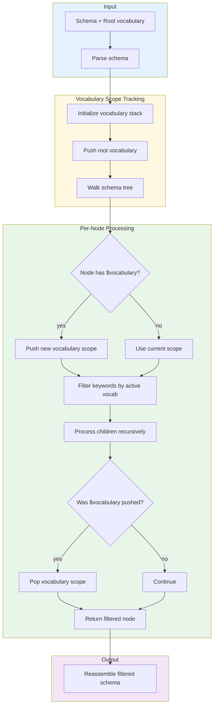
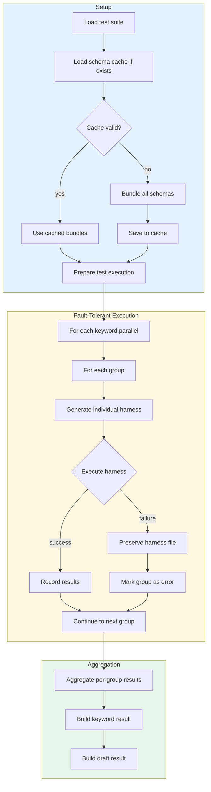

# valbridge CLI - Analysis & Proposed Improvements

## Executive Summary

The CLI is well-architected with clear separation of concerns. However, there are critical JSON Schema spec compliance issues, performance bottlenecks, and several edge cases not handled correctly.

---

## Critical Issues

### 1. Dynamic References Not Supported

**Location:** `bundler/bundler.go:263, 277-279`

**Problem:** `$dynamicRef`, `$dynamicAnchor`, `$recursiveRef`, `$recursiveAnchor` are explicitly rejected.

**Impact:** Breaks draft2020-12 schemas using dynamic references. These are used for extensible schemas where the reference target is determined at validation time.

**Example failing schema:**
```json
{
  "$dynamicRef": "#meta",
  "$defs": {
    "Meta": {"$dynamicAnchor": "meta", "type": "string"}
  }
}
```

**Options:**
1. Implement dynamic reference resolution (complex)
2. Document as unsupported with clear error message (recommended for now)

---

### 2. RFC 6901 JSON Pointer Unescaping Order Wrong

**Location:** `bundler/bundler.go:956-965`

**Problem:** Current order is URI decode → JSON pointer unescape. Spec says JSON pointer unescape first (`~1` → `/`, `~0` → `~`), then URI decode.

**Impact:** Refs with special characters fail silently or resolve incorrectly.

**Fix:**
```go
// Current (wrong):
segment = url.PathUnescape(segment)
segment = strings.ReplaceAll(segment, "~1", "/")
segment = strings.ReplaceAll(segment, "~0", "~")

// Should be:
segment = strings.ReplaceAll(segment, "~1", "/")
segment = strings.ReplaceAll(segment, "~0", "~")
segment = url.PathUnescape(segment)
```

---

### 3. Scope Handling After $id

**Location:** `bundler/bundler.go:286-298`

**Problem:** When `$id` is found, `currentScopePath` is reset to empty. But scope should only reset for descendants, not siblings.

**Example:**
```json
{
  "properties": {
    "a": {"$id": "a.json", "$ref": "#/something"},
    "b": {"$ref": "#/properties/a"}  // This ref might break
  }
}
```

**Impact:** Nested refs inside scoped schemas may not resolve correctly.

---

### 4. Vocabulary Filtering Ignores Nested $vocabulary

**Location:** `vocabulary/vocabulary.go:87-125`

**Problem:** Doesn't respect `$vocabulary` declarations in nested subschemas.

**Example:**
```json
{
  "$vocabulary": {"...validation": false},
  "properties": {
    "nested": {
      "$vocabulary": {"...validation": true},
      "minLength": 1  // Should NOT be filtered, but currently IS
    }
  }
}
```

---

### 5. Anchor Path Rewriting Incomplete

**Location:** `bundler/bundler.go:469-479`

**Problem:** When remote schema has anchor, deeply nested anchors may not rewrite correctly after flattening.

---

## JSON Schema Spec Compliance Issues

| Feature | Status | Issue |
|---------|--------|-------|
| `$dynamicRef` | ✗ Rejected | Not implemented |
| `$dynamicAnchor` | ✗ Rejected | Not implemented |
| `$recursiveRef` | ✗ Rejected | Not implemented |
| `$recursiveAnchor` | ✗ Rejected | Not implemented |
| RFC 6901 escaping | ⚠️ Wrong order | See issue #2 |
| Fragment-only `$id` | ⚠️ Ambiguous | `$id: "#foo"` treated as anchor |
| Scope changes | ⚠️ Overly aggressive | Resets for siblings too |
| Nested `$vocabulary` | ✗ Ignored | Not scoped correctly |

---

## Performance Issues

### 1. Sequential Fetching in Processor Stage 1

**Location:** `processor/processor.go:291-323`

**Problem:** External refs are fetched sequentially in a loop.

**Impact:** Slow for schemas with many external references.

**Fix:** Use `golang.org/x/sync/errgroup` (already in go.mod).

---

### 2. No Compiled Schema Caching in Validator

**Location:** `validator/validator.go`

**Problem:** Every validation recompiles the schema from scratch.

**Impact:** Repeated validations of same schema are slow.

---

### 3. Redundant Metaschema Fetching

**Location:** `processor/processor.go`, `metaschema/metaschema.go`

**Problem:** Processor crawls and caches schemas, but metaschema module has separate cache. Custom metaschema may be fetched twice.

---

### 4. Quadratic Complexity in $defs Flattening

**Location:** `bundler/bundler.go` flattenDefs

**Problem:** Deeply nested `$defs` cause O(d²) rewrite operations where d = nesting depth.

---

## Missing Features

| Feature | Impact | Priority |
|---------|--------|----------|
| Dynamic refs | Breaks draft2020-12 advanced use | HIGH |
| Fetch retry in metaschema | Network hiccups fail immediately | MEDIUM |
| Parallel processor fetching | Performance | MEDIUM |
| Compiled schema cache | Performance | LOW |
| Vocabulary requirement checking | Spec compliance | LOW |
| Bidirectional refs | Rare schemas fail | LOW |

---

## Compliance Command Issues

### 1. No Incremental Caching

**Location:** `compliance/runner.go`

**Problem:** Each run re-bundles all schemas from scratch.

**Impact:** Repeated runs are slow.

### 2. Single Harness Per Keyword

**Location:** `compliance/runner.go:processKeyword`

**Problem:** All groups in keyword go into one harness. If harness execution fails, entire keyword fails.

**Impact:** No partial failure recovery.

### 3. Temp File Cleanup on Failure

**Location:** `compliance/harness.go:591`

**Problem:** `defer os.Remove(tempHarness)` deletes file even on error.

**Impact:** Can't debug failed harness execution.

---

## Proposed Improvements

### Improved Processor Pipeline



### Improved Bundler Flow



### Improved Vocabulary Filtering



### Improved Compliance Runner



---

## Priority Matrix

| Issue | Severity | Effort | Priority |
|-------|----------|--------|----------|
| RFC 6901 order | HIGH | LOW | P0 |
| Scope handling | HIGH | MEDIUM | P0 |
| Dynamic refs (document) | MEDIUM | LOW | P1 |
| Parallel fetching | MEDIUM | MEDIUM | P1 |
| Vocabulary scoping | MEDIUM | HIGH | P2 |
| Anchor path rewriting | MEDIUM | MEDIUM | P2 |
| Compiled schema cache | LOW | MEDIUM | P3 |
| Compliance caching | LOW | HIGH | P3 |

---

## Recommended Action Plan

### Phase 1: Critical Fixes (Low Effort, High Impact)

1. **Fix RFC 6901 unescaping order** - 1 line fix
2. **Add clear error for dynamic refs** - Document limitation
3. **Fix scope reset logic** - Track scope per subtree

### Phase 2: Performance Improvements

1. **Parallel fetching in processor** - Use existing errgroup
2. **Shared cache between processor and metaschema** - Refactor to single cache

### Phase 3: Spec Compliance

1. **Vocabulary scoping** - Requires scope tracking infrastructure
2. **Anchor path rewriting** - Build on scope tracking

### Phase 4: Nice to Have

1. **Compiled schema cache** - Thread-safe cache with LRU
2. **Incremental compliance caching** - Hash-based cache invalidation

---

## Questions to Resolve

- dynamic ref support: full implementation vs documented limitation?
- vocabulary scoping: strict spec compliance needed for target use cases?
- compliance caching: worth complexity for CI/CD speed?
- older drafts (draft-03, draft-04): full support needed?
