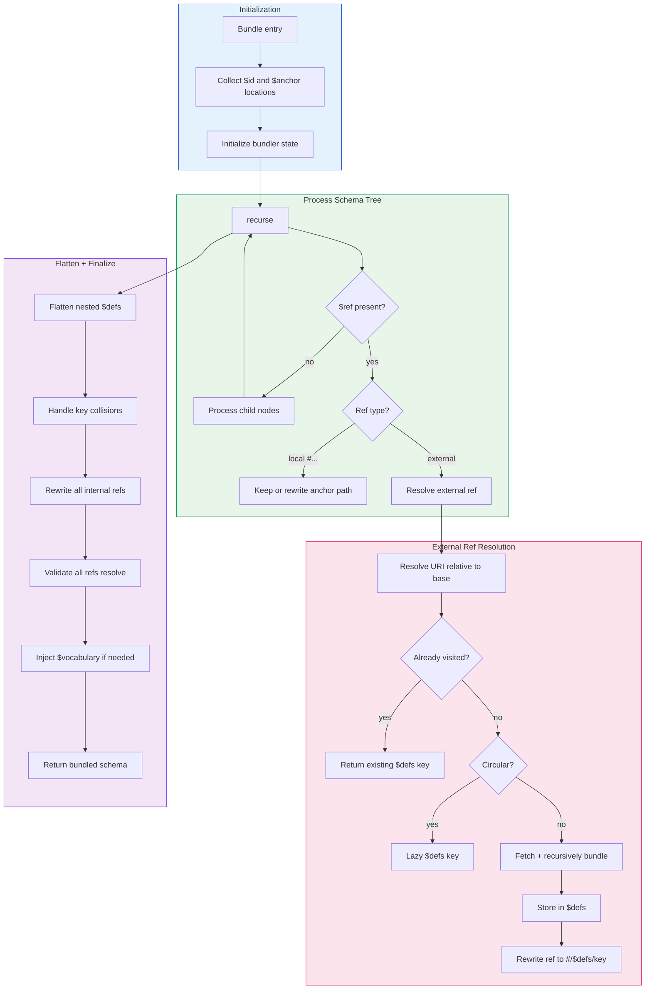
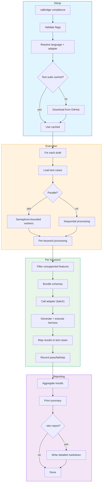
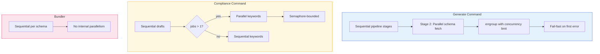
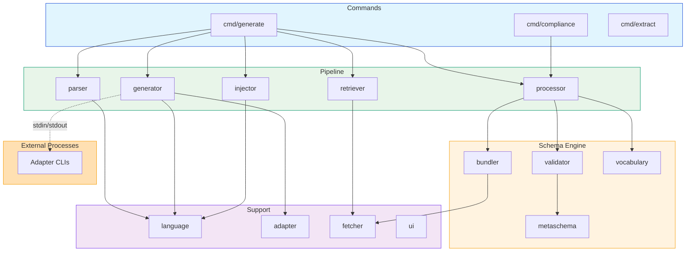

# valbridge CLI -- Architecture Reference

This document describes the internal architecture of the valbridge CLI, including command flows, data types, concurrency model, and module dependencies.

---

## Commands

The CLI has three main commands:

| Command | Purpose |
| --- | --- |
| `generate` | Generate Zod validators or Pydantic models from valbridge configs |
| `extract` | Extract a single schema as JSON for debugging |
| `compliance` | Run the JSON Schema Test Suite against an adapter |

---

## Generate Command Flow

The `generate` command follows a five-stage pipeline. Each stage has a single responsibility and a well-defined input/output contract.

```mermaid
flowchart TD
    subgraph Entry["Entry Point"]
        A["valbridge generate"] --> B["Load .env file"]
        B --> C["Resolve project + output dirs"]
    end

    subgraph Parse["Stage 1 -- Parse"]
        C --> D["Discover config files"]
        D --> D1{"git available?"}
        D1 -->|yes| D1b["git ls-files *.jsonc"]
        D1 -->|no| D1c["filepath.WalkDir"]
        D1b --> D2["Parse each config"]
        D1c --> D2
        D2 --> D3["Validate $schema URL"]
        D3 --> D4["Detect language + namespace"]
        D4 --> D5{"Duplicate IDs?"}
        D5 -->|yes| D5e["Error: conflicting definitions"]
        D5 -->|no| D6["ParseResult"]
    end

    subgraph Retrieve["Stage 2 -- Retrieve"]
        D6 --> E["Fetch schemas in parallel"]
        E --> E1{"Source type?"}
        E1 -->|URL| E2["HTTP GET + retry"]
        E1 -->|File| E3["Read from disk"]
        E1 -->|JSON| E4["Use inline"]
        E2 --> E5["Cache result"]
        E3 --> E5
        E4 --> E5
        E5 --> E6["RetrievedSchema array"]
    end

    subgraph Process["Stage 3 -- Process"]
        E6 --> F1["Crawl $ref graph"]
        F1 --> F2["Validate against metaschemas"]
        F2 --> F3["Bundle into self-contained schemas"]
        F3 --> F4["Filter by vocabulary"]
        F4 --> F5["ProcessedSchema array"]
    end

    subgraph Generate["Stage 4 -- Generate"]
        F5 --> G1["Group by adapter"]
        G1 --> G2["Build adapter command"]
        G2 --> G3["JSON stdin to adapter process"]
        G3 --> G4["Parse JSON stdout"]
        G4 --> G5["ConvertResult array"]
    end

    subgraph Inject["Stage 5 -- Inject"]
        G5 --> H1["Merge imports + build template"]
        H1 --> H2["Write output files"]
        H2 --> H3["Update manifest"]
        H3 --> H4["Clean stale files"]
        H4 --> H5["Done"]
    end

    style Entry fill:#e1f5fe,stroke:#1D4ED8
    style Parse fill:#fff3e0,stroke:#f59e0b
    style Retrieve fill:#e8f5e9,stroke:#059669
    style Process fill:#fce4ec,stroke:#E92063
    style Generate fill:#f3e5f5,stroke:#7c3aed
    style Inject fill:#e0f2f1,stroke:#0d9488
```

---

## Data Type Flow

Each pipeline stage transforms data through well-defined types:

```mermaid
flowchart LR
    subgraph Parse
        P1["ConfigFile"] --> P2["Declaration"]
        P2 --> P3["ParseResult"]
    end

    subgraph Retrieve
        R1["Declaration"] --> R2["RetrievedSchema"]
    end

    subgraph Process
        PR1["RetrievedSchema"] --> PR2["ProcessedSchema"]
    end

    subgraph Generate
        G1["ProcessedSchema"] --> G2["ConvertInput"]
        G2 --> G3["ConvertResult"]
    end

    subgraph Inject
        I1["ConvertResult"] --> I2["TemplateData"]
        I2 --> I3["GeneratedFile"]
    end

    P3 --> R1
    R2 --> PR1
    PR2 --> G1
    G3 --> I1

    style Parse fill:#e1f5fe,stroke:#1D4ED8
    style Retrieve fill:#fff3e0,stroke:#f59e0b
    style Process fill:#e8f5e9,stroke:#059669
    style Generate fill:#fce4ec,stroke:#E92063
    style Inject fill:#f3e5f5,stroke:#7c3aed
```

---

## Bundler Internal Flow

The bundler resolves `$ref` references, inlines external schemas, and flattens nested `$defs` into a self-contained document.

---

## Compliance Command Flow

The `compliance` command runs the official JSON Schema Test Suite against an adapter to verify correctness.

---

## Concurrency Model

---

## Module Dependencies

---

## Error Handling

Each pipeline stage has distinct error handling behavior:

| Stage | Error Type | Behavior |
| --- | --- | --- |
| **Parse** | File read/parse error | Skip file, log verbose |
| **Parse** | Duplicate schema ID | Fatal error |
| **Parse** | Multiple languages (no `--lang`) | Fatal error |
| **Retrieve** | HTTP error | Retry with backoff, then fatal |
| **Retrieve** | Missing env var in headers | Fatal error |
| **Process** | Fetch/validation/bundle error | Fatal error |
| **Process** | Vocabulary extraction failure | Log warning, continue |
| **Generate** | Adapter not found | Fatal error |
| **Generate** | Adapter non-zero exit | Fatal error |
| **Generate** | Invalid JSON output | Fatal error |
| **Inject** | Directory/write error | Fatal error |
| **Inject** | Duplicate varName | Fatal error |
