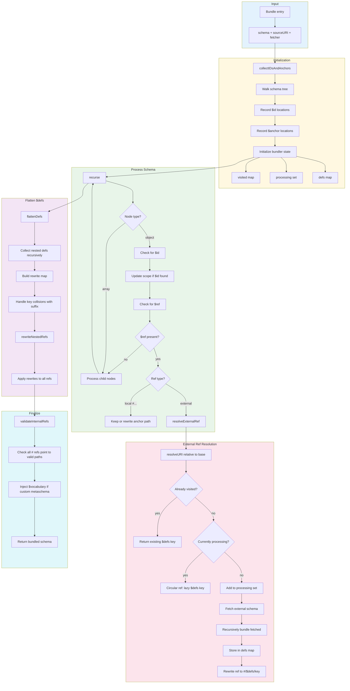
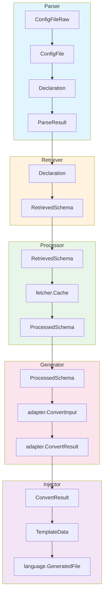
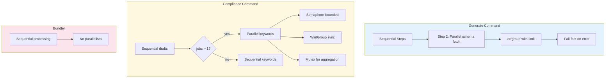
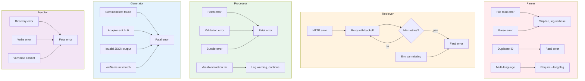
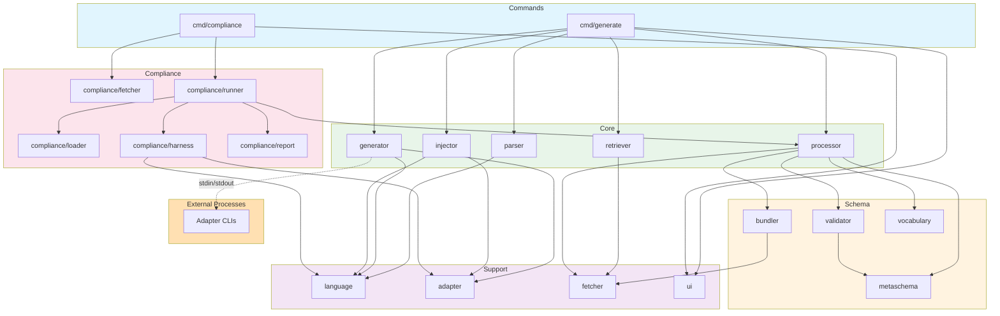

# valbridge CLI - Current Architecture Flow

## Overview

The CLI has two main commands:

- **generate** - converts JSON Schemas to native validators
- **compliance** - runs JSON Schema Test Suite against adapters

---

## Generate Command Flow

```mermaid
flowchart TD
    subgraph Entry["Entry Point (cmd/generate.go)"]
        A[runGenerate] --> B[Load .env file]
        B --> C[Resolve project/output dirs]
    end

    subgraph Parse["Step 1: Parse (parser/)"]
        C --> D[parser.Parse]
        D --> D1[getConfigFiles]
        D1 --> D1a{git available?}
        D1a -->|yes| D1b[git ls-files *.json *.jsonc]
        D1a -->|no| D1c[filepath.WalkDir]
        D1b --> D2
        D1c --> D2
        D2[parseConfigFile foreach] --> D2a[Read file]
        D2a --> D2b[hujson: JSONC → JSON]
        D2b --> D2c[Validate $schema URL]
        D2c --> D2d[Detect language]
        D2d --> D2e[Derive namespace from filename]
        D2e --> D3[mergeDeclarations]
        D3 --> D3a{Duplicate IDs?}
        D3a -->|yes| D3b[Error: conflicting definitions]
        D3a -->|no| D3c{Multi-language?}
        D3c -->|yes, no filter| D3d[Error: require --lang]
        D3c -->|no| D4[ParseResult]
    end

    subgraph Retrieve["Step 2: Retrieve (retriever/)"]
        D4 --> E[retriever.Retrieve]
        E --> E1[For each declaration in parallel]
        E1 --> E2[Resolve env vars in headers]
        E2 --> E3[Build cache key]
        E3 --> E4{Cache hit?}
        E4 -->|yes| E5[Return cached]
        E4 -->|no| E6{Source type?}
        E6 -->|URL| E7[RetrieveFromURL]
        E7 --> E7a[HTTP GET with retry]
        E7a --> E7b[Validate JSON]
        E6 -->|File| E8[os.ReadFile]
        E8 --> E8a[Resolve relative to config]
        E6 -->|JSON| E9[Use inline schema]
        E7b --> E10[Cache result]
        E8a --> E10
        E9 --> E10
        E10 --> E11[RetrievedSchema array]
    end

    subgraph Process["Step 3: Process (processor/)"]
        E11 --> F[processor.Process]

        subgraph Crawl["Phase 1: Crawl & Fetch"]
            F --> F1[crawlAndFetch]
            F1 --> F1a[Mark declared URIs visited]
            F1a --> F1b[Extract $refs from all schemas]
            F1b --> F1c{Frontier empty?}
            F1c -->|no| F1d[Fetch unvisited refs]
            F1d --> F1e[Add to cache]
            F1e --> F1f[Extract refs from fetched]
            F1f --> F1c
            F1c -->|yes| F1g[Complete cache]
        end

        subgraph Validate["Phase 2: Validate"]
            F1g --> F2[validateAll]
            F2 --> F2a[Build metaschemas map]
            F2a --> F2b[Validate declared schemas]
            F2b --> F2c[Validate external schemas]
            F2c --> F2d{Valid?}
            F2d -->|no| F2e[Error: validation failed]
            F2d -->|yes| F3
        end

        subgraph Bundle["Phase 3: Bundle"]
            F3[bundleAll] --> F3a[Add declared to cache]
            F3a --> F3b[For each declared schema]
            F3b --> F3c[bundler.Bundle with CacheFetcher]
            F3c --> F3d[Extract vocabulary from metaschema]
            F3d --> F3e[vocabulary.FilterSchema]
            F3e --> F3f[ProcessedSchema array]
        end
    end

    subgraph Generate["Step 4: Generate (generator/)"]
        F3f --> G[generator.GenerateAll]
        G --> G1[GroupByAdapter]
        G1 --> G2[For each adapter sorted]
        G2 --> G3[lang.AdapterInvoker build command]
        G3 --> G4[exec.LookPath check]
        G4 --> G5[Build ConvertInput array]
        G5 --> G5a[Compute varName per schema]
        G5a --> G6[JSON stdin → adapter process]
        G6 --> G7[Parse stdout JSON]
        G7 --> G8{Validate outputs}
        G8 -->|varName mismatch| G8a[Error: adapter mismatch]
        G8 -->|ok| G9[ConvertResult array]
    end

    subgraph Inject["Step 5: Inject (injector/)"]
        G9 --> H[injector.Inject]
        H --> H1[buildTemplateData]
        H1 --> H1a[Collect all imports]
        H1a --> H1b[lang.MergeImports]
        H1b --> H1c[Build SchemaEntry array]
        H1c --> H1d{varName conflicts?}
        H1d -->|yes| H1e[Error: duplicate varName]
        H1d -->|no| H1f[Build header/footer]
        H1f --> H2[Execute language template]
        H2 --> H3[WriteGeneratedFiles]
        H3 --> H3a[Load previous manifest]
        H3a --> H3b[Delete stale files]
        H3b --> H3c[Create directories]
        H3c --> H3d[Write output files]
        H3d --> H3e[Atomic manifest write]
        H3e --> I[Done: summary output]
    end

    style Entry fill:#e1f5fe
    style Parse fill:#fff3e0
    style Retrieve fill:#e8f5e9
    style Process fill:#fce4ec
    style Generate fill:#f3e5f5
    style Inject fill:#e0f2f1
```

---

## Bundler Internal Flow

---

## Compliance Command Flow

```mermaid
flowchart TD
    subgraph Entry["Entry Point (cmd/compliance.go)"]
        A[runCompliance] --> B[Validate flags]
        B --> C[Resolve language config]
        C --> D[Resolve adapter path]
        D --> E[FetchTestSuite]
    end

    subgraph Fetch["Test Suite Fetching (compliance/fetcher.go)"]
        E --> E1{Cache exists?}
        E1 -->|yes| E2[Return cached path]
        E1 -->|no| E3[Download from GitHub]
        E3 --> E4[Gzip + Tar extract]
        E4 --> E5[Store in ~/.cache/valbridge/]
        E5 --> E2
    end

    subgraph Setup["Setup"]
        E2 --> F[Detect harness runner]
        F --> G[compliance.Run]
    end

    subgraph Run["Runner (compliance/runner.go)"]
        G --> G1[Load unsupported-features.json]
        G1 --> G2[For each draft]
        G2 --> G3[runDraft]

        subgraph Draft["Per-Draft Execution"]
            G3 --> H1[LoadTestSuite]
            H1 --> H2[Sort keywords]
            H2 --> H3{Concurrency > 1?}
            H3 -->|yes| H4[runDraftParallel]
            H3 -->|no| H5[runDraftSequential]
            H4 --> H6[Semaphore + WaitGroup]
            H5 --> H7[processKeyword foreach]
            H6 --> H7
        end
    end

    subgraph Keyword["Keyword Processing"]
        H7 --> I1["Phase 1: Pre-filter & Bundle"]
        I1 --> I1a[Mark unsupported as skipped]
        I1a --> I1b[processor.Process with LocalhostFetcher]
        I1b --> I2["Phase 2: Batch Adapter Call"]
        I2 --> I2a[CallAdapterBatch]
        I2a --> I2b[stdin JSON → adapter → stdout JSON]
        I2b --> I3["Phase 3: Harness Execution"]
        I3 --> I3a[GenerateHarness]
        I3a --> I3b[Merge imports]
        I3b --> I3c[Execute template]
        I3c --> I3d[Create temp file]
        I3d --> I3e[ExecuteHarness]
        I3e --> I3f[Parse JSON results]
        I3f --> I4[processHarnessResults]
        I4 --> I4a[Map results to original tests]
        I4a --> I4b[Determine pass/fail]
        I4b --> I4c[Update counters]
    end

    subgraph Report["Reporting (compliance/report.go)"]
        I4c --> J1[Aggregate draft results]
        J1 --> J2{--dev-report?}
        J2 -->|yes| J3[WriteResults to file]
        J2 -->|no| J4[Print to stdout]
        J3 --> J5[GenerateMarkdownReport]
        J4 --> J5
        J5 --> J6[Print unsupported features]
        J6 --> J7{--profile?}
        J7 -->|yes| J8[Print timing breakdown]
        J7 -->|no| K[Done]
        J8 --> K
    end

    style Entry fill:#e1f5fe
    style Fetch fill:#fff3e0
    style Setup fill:#e8f5e9
    style Run fill:#fce4ec
    style Keyword fill:#f3e5f5
    style Report fill:#e0f2f1
```

---

## Processor Pipeline Detail

```mermaid
flowchart LR
    subgraph Stage1["Stage 1: Crawl & Fetch"]
        direction TB
        A1[RetrievedSchema array] --> A2[Extract $refs]
        A2 --> A3[Build frontier queue]
        A3 --> A4[Fetch unvisited refs]
        A4 --> A5[Add to cache]
        A5 --> A6{More refs?}
        A6 -->|yes| A4
        A6 -->|no| A7[Complete cache]
    end

    subgraph Stage2["Stage 2: Validate"]
        direction TB
        B1[Schemas + Cache] --> B2[Build metaschemas map]
        B2 --> B3[Extract custom $schema URIs]
        B3 --> B4[Lookup in cache]
        B4 --> B5[validator.ValidateSchemaWithOptions]
        B5 --> B6[For each declared schema]
        B6 --> B7[For each external schema]
    end

    subgraph Stage3["Stage 3: Bundle"]
        direction TB
        C1[Validated schemas] --> C2[Create CacheFetcher]
        C2 --> C3[bundler.Bundle per schema]
        C3 --> C4[Extract $vocabulary]
        C4 --> C5[vocabulary.FilterSchema]
        C5 --> C6[ProcessedSchema]
    end

    A7 --> B1
    B7 --> C1

    style Stage1 fill:#e3f2fd
    style Stage2 fill:#fff8e1
    style Stage3 fill:#e8f5e9
```

---

## Data Type Flow

---

## Concurrency Model

---

## Error Handling Flow

---

## Module Dependencies

