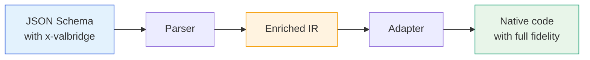
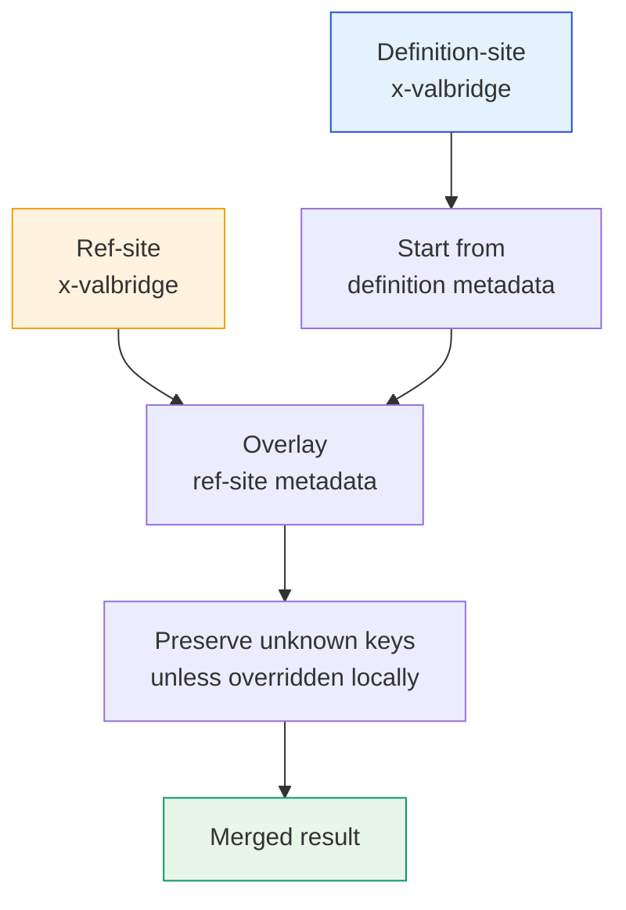

# Enriched `x-valbridge` Format

The canonical metadata container for carrying cross-language generation hints through the JSON Schema pipeline.

---

## Overview



The `x-valbridge` extension carries metadata that JSON Schema alone cannot express -- coercion modes, transform chains, source registry info -- enabling adapters to generate higher-fidelity native code.

---

## Shape

```json
{
  "type": "string",
  "x-valbridge": {
    "version": "1.0",
    "coercionMode": "strict",
    "transforms": ["trim"],
    "registryMeta": {
      "source": "pydantic"
    }
  }
}
```

---

## Rules

| Rule | Description |
| --- | --- |
| Single container | Do not scatter metadata across `x-valbridge-*` keys |
| Uniform shape | Root and nested nodes use the same container structure |
| Forward compatibility | Unknown keys must be preserved, not discarded |
| Optional | Standard JSON Schema behavior is unchanged when `x-valbridge` is absent |

---

## Supported Fields

| Field | Type | Description |
| --- | --- | --- |
| `version` | `string` | Schema version for the extension format |
| `coercionMode` | `"strict" \| "coerce"` | Whether the target should coerce or reject invalid types |
| `transforms` | `string[]` | Ordered list of transforms to apply (e.g., `["trim", "toLowerCase"]`) |
| `registryMeta` | `object` | Source registry metadata (e.g., `{ "source": "pydantic" }`) |
| `codeStubs` | `object` | Hints for adapter code generation |
| `defaultBehavior` | `object` | Default timing semantics (default vs prefault) |
| `aliasInfo` | `object` | Property-level alias metadata |

---

## Merge Rule For `$ref`

When both the referenced definition and the `$ref` site include enrichment:



1. Start from definition-site metadata
2. Overlay ref-site metadata
3. Preserve unknown keys unless the same key is overridden locally

This keeps referenced canonical metadata while allowing local specialization.
