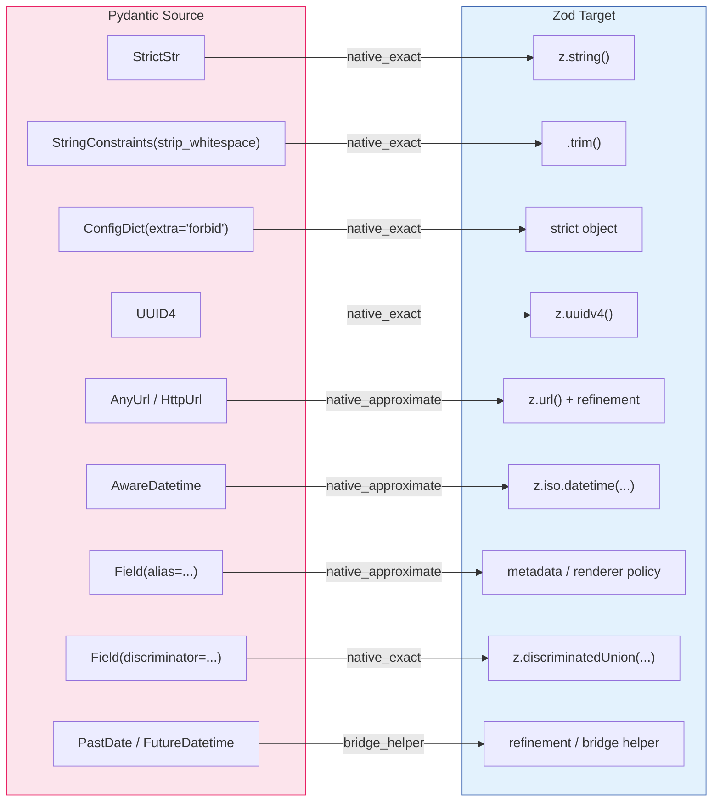
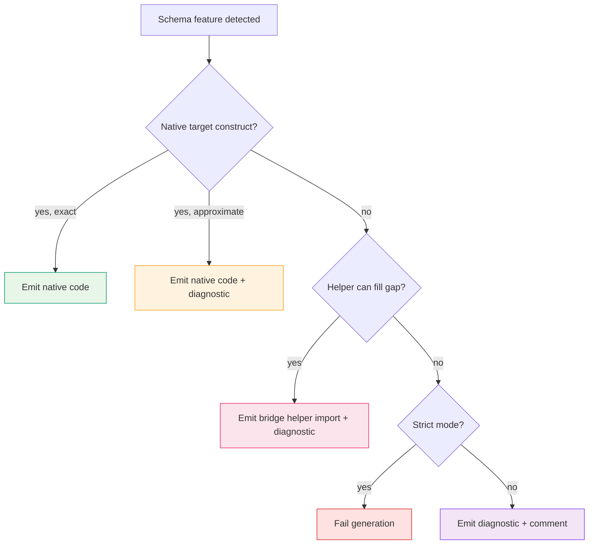

# Direct Converter Feature Matrix

Cross-language mapping table for the valbridge direct conversion path.

**Scope:** Zod `4.3.x` and Pydantic `2.12.x` only.

---

## Fidelity Classes

| Class | Meaning | Action |
| --- | --- | --- |
| `native_exact` | Direct target-library construct with materially equivalent behavior | Emit native code |
| `native_approximate` | Target construct exists but semantics drift in a known way | Emit native code + diagnostic |
| `bridge_helper` | Parity requires a small repo-local helper runtime | Emit helper import + diagnostic |
| `unsupported_stub` | Cannot be emitted safely | Surface diagnostic or fail in strict mode |

---

## Core Mapping Table

### Pydantic to Zod

### Full Mapping Reference

| Source Feature | Pydantic Source | Zod Target | Fidelity | Diagnostic |
| --- | --- | --- | --- | --- |
| Strict string | `StrictStr` | `z.string()` | `native_exact` | `native.exact.strict_string` |
| String trim | `StringConstraints(strip_whitespace=True)` | `.trim()` | `native_exact` | `native.exact.string_trim` |
| Object forbid extras | `ConfigDict(extra='forbid')` | strict object behavior | `native_exact` | `native.exact.object_extra_forbid` |
| UUID v4 | `UUID4` | `z.uuidv4()` | `native_exact` | `native.exact.uuid_v4` |
| URL | `AnyUrl` / `HttpUrl` | `z.url()` plus optional refinement | `native_approximate` | `native.approx.url` |
| Datetime ISO | `AwareDatetime` / `NaiveDatetime` | `z.iso.datetime(...)` where possible | `native_approximate` | `native.approx.iso_datetime` |
| Field alias | `Field(alias=...)` | metadata only + renderer policy | `native_approximate` | `native.approx.alias` |
| Field discriminator | `Field(discriminator=...)` | `z.discriminatedUnion(...)` when sound | `native_exact` | `native.exact.discriminator` |
| Left-to-right union | `Field(union_mode='left_to_right')` | no direct equivalent | `bridge_helper` | `bridge.union.left_to_right` |
| Temporal predicates | `PastDate`, `FutureDatetime`, etc. | refinement/helper | `bridge_helper` | `bridge.temporal.bound` |
| Custom validators | `field_validator`, `model_validator` | comment + hook only | `unsupported_stub` | `unsupported.custom_validator` |

### Zod to Pydantic

| Source Feature | Zod Source | Pydantic Target | Fidelity | Diagnostic |
| --- | --- | --- | --- | --- |
| Transform chain | `.trim()`, `.toLowerCase()` | `StringConstraints` or validators | mixed | `native.exact.transform.*` |
| Default | `.default()` | `Field(default=...)` | `native_exact` | `native.exact.default` |
| Prefault | `.prefault()` | no direct primitive | `bridge_helper` | `bridge.default.prefault` |
| Metadata | `.describe()`, `.meta()` | `Field(...)`, `json_schema_extra` | `native_exact` | `native.exact.metadata` |
| XOR semantics | refined unions | no native single API | `bridge_helper` | `bridge.object.xor` |

---

## Hard API Corrections

These are common mistakes that the renderer must avoid:

- Use `z.url()`, not `z.httpUrl()`
- Use instance `.prefault(value)`, not a top-level Zod helper
- Do not emit `z.xor()`
- Treat Pydantic `union_mode='left_to_right'` as field-level only
- Never emit always-failing runtime placeholders for unsupported validators

---

## Generation Policy

1. Prefer native target constructs first
2. Introduce a helper runtime only after a repeated parity gap is proven with tests
3. Emit explicit diagnostics for every non-exact mapping
4. Fail generation in strict mode instead of producing unsound runtime stubs
