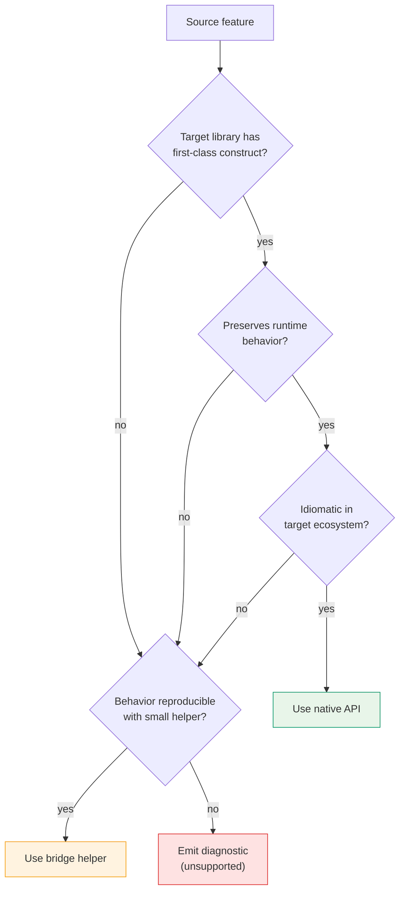

# Native vs Bridge Decision Rules

Decision framework for when the direct converter should use native target APIs versus bridge helpers.

---

## Decision Flow

---

## Use Native Target APIs When

- The target library has a first-class construct
- The construct preserves the important runtime behavior
- The emitted code remains idiomatic for the target ecosystem

**Examples:**
- Pydantic strict scalar types
- Pydantic `Field(...)` metadata
- Zod string transforms like `.trim()`
- Zod discriminated unions when the discriminator is explicit and sound

---

## Use A Bridge Helper When

- Behavior is reproducible but not directly representable
- The helper can stay small, local, and explicit
- The helper can be tested independently

**Examples:**
- Temporal past/future predicates
- Prefault-like behavior with nontrivial default timing semantics
- XOR object semantics
- Normalization helpers shared across many emitted schemas

---

## Do Not Emit Silent Drift

If the converter cannot preserve semantics natively or through a small helper:

1. Emit a structured diagnostic
2. Add a generated comment where helpful
3. Optionally fail generation in strict mode

---

## Helper Runtime Constraints

| Constraint | Rule |
| --- | --- |
| Scope | Repo-local packages only |
| Version | Zod `4.3.x` and Pydantic `2.12.x` only |
| Dependency model | Opt-in dependencies of emitted code, not global runtime assumptions |
| Size | Small and focused -- one concern per helper |
| Testing | Each helper must have independent tests |
